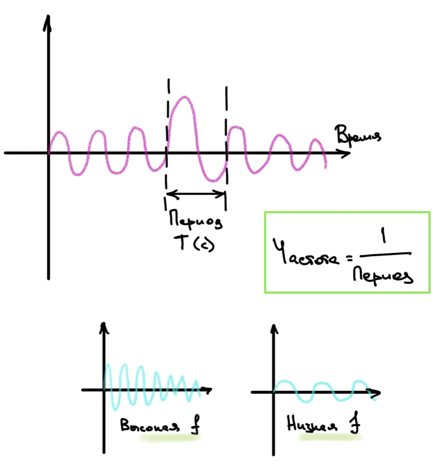
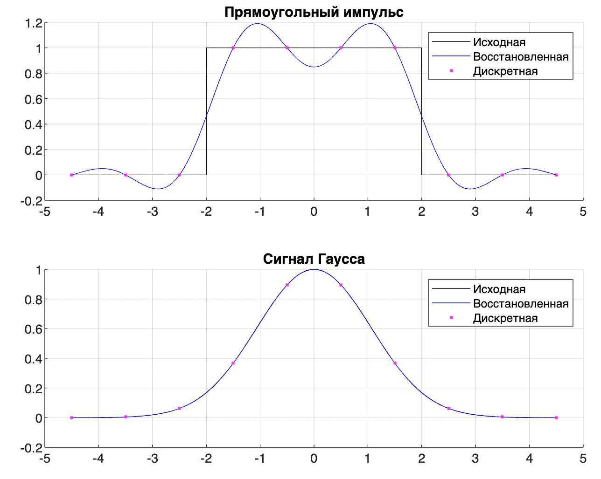

## ЛР1

### Как поставить себе Mathlab

1. Отключаем рабочий впн
2. Заходим на официальный сайт https://www.mathworks.com/products/matlab-online.html
3. Создаем новый аккаунт
4. В качестве почты я использовала vk.com, в качестве страны - Албанию, в качестве вуза - University of Tirana
5. Профит

### Как запустить код лабы

1. Создать новый скрипт, назвать lab_01
2. Подложить код из файла
3. Нажать на зеленую стрелку справа сверху
4. Если тупит ввести в командую строку снизу число (и потом еще одно)


### Задание

Источник: https://github.com/Winterpuma/bmstu_DSP/tree/main/lab_01


----

### Немного теории

#### Дискретизация

**Процесс дискретизации** - это процесс преобразования непрерывного сигнала в дискретный формат. 

**Основная идея дискретизации** заключается в том, что непрерывный аналоговый сигнал представляется в виде последовательности дискретных отсчетов (временных или пространственных), полученных с определенным интервалом дискретизации. Как уже упоминалось в теореме Котельникова, важно обеспечить адекватную частоту дискретизации, чтобы избежать потерь информации при дискретизации.


#### Импульсы

1. **Прямоугольный импульс**
   * **Описание**: представляет собой сигнал, который имеет постоянную амплитуду на определенном интервале времени и нулевую амплитуду вне этого интервала. Формально это функция, равная 1 внутри определенного интервала и 0 вне него.
   * **Характеристики**: характеризуется шириной импульса (длительностью времени, в течение которого сигнал не нулевой) и амплитудой.
   * **Применение**: часто используется в обработке сигналов, цифровой обработке изображений, телекоммуникациях и других областях.


2. **Гауссовский сигнал**

   * **Описание**: представляет собой сигнал, который имеет форму, сходную с колокольчиком, также известным как нормальное распределение. Он имеет симметричную форму и характеризуется плавным изменением амплитуды от максимума к нулю.
   * **Характеристики**: определяется математической функцией, которая имеет пиковое значение в центре и убывающую амплитуду по мере удаления от центра.
   * **Применение**: часто используются в обработке сигналов, фильтрации, сжатии данных, машинном обучении и других областях.

   

#### Теорема Котельникова

"*Если сигнал ограничен в частотной области спектра и не содержит частот выше определенной частоты, то для его полной дискретизации частота дискретизации должна быть не менее чем в два раза больше максимальной частоты сигнала.*"

Видос: https://www.youtube.com/watch?v=p-4nIChwIjs

**В трех картинках**

1. Частота

   

2. Алиасинг -- неразличимость сигналов при дискретизации (частота двух синусоид дискретных сигналов отличается на 2pi => их неполучается различить)

   

3. Теорема -- непрерывный сигнал с ограниченным спекторм можно будет восстановить по его дискретным подсчетам, если они были взяты с частотой дискретизации, превыщающей максимальную частоту сигнала минимум в два раза

   

---

### Практика

#### Основная часть кода

```matlab
sigma = 1.5; % параметр гауссовского распределения (см. формулу)
L = 2;       % параметр прямоугольного импульса

% Дискретные сигналы
n = input('Input number of samples: ');  % количество выборок
dt = input('Input sample step: ');       % шаг дискретизации

t_max = dt * (n-1) / 2;  % половина диапазона времени для дискретизации
t = -t_max:dt:t_max;     % вектор времени (с учетом введенного пользователем шага) 

gauss_discrete = exp(-(t/sigma).^2);  % сигнал Гаусса на основе вектора t
rect_discrete = zeros(size(t));       % создать вектор из 0 размера t
rect_discrete(abs(t) - L < 0) = 1;    % внутри интервала [-L, L] точкам присваивается значение 1

% Исходные сигналы
% все тоже самое, что и в дискретных, только шаг очень маленький
x = -t_max:0.005:t_max;
gauss_ref = exp(-(x/sigma).^2);
rect_ref = zeros(size(x));
rect_ref(abs(x) - L < 0) = 1;

% Восстановленные сигналы
gauss_restored = zeros(1, length(x));
rect_restored = zeros(1, length(x));
for i=1:length(x)
   for j = 1:n
       gauss_restored(i) = gauss_restored(i) + gauss_discrete(j) * sin((x(i)-t(j))/dt * pi) / ((x(i)-t(j))/dt * pi);
       rect_restored(i) = rect_restored(i) + rect_discrete(j) * sin((x(i)-t(j))/dt * pi) / ((x(i)-t(j))/dt * pi);
   end
end

```


#### Пример результата 

(sigma = 1.5, L = 2, n = 10, dt = 1)



Собственно, на этой картинке видно проблемы с прямоугольным импульсом, ответ на то, как это исправить:

> При резком перепаде появляются всплески интенсивности (эффект Гибса) чтобы этого не возникало используют сглаженные окна (например окно Ханна).


#### Некоторые полезные факты

1. Сигма (гауссовское распределение) влияет на жирность колокола, насколько он будет растянут (на рисунках ниже сигма равна 10 и 100 соответственно). 

   

   

2. L - параметр прямоугольного импульса, значение функции будет равно единице в точках [-L, L] (на рисунке ниже n = 20)

   

3. n - количество выборок, то есть количество фиолетовых точек

4. dt - шаг дискретизации, то есть расстояние на которое фиолетовые точки отстоят друг от друга

5. t_max - половина времени дискретизации, расчитывается исходя из параметров n и dt (например, я выбрала 5 точек с шагом 1)

   

6. Дискретный и исходный сигналы расчитываются одинаково, с точностью до используемого шага. Поэтому не имеет смысла брать слишком маленький шаг

7. Как работает эта сложная формула восстановленного сигнала - я пока сама не поняла, но что-то такое:

   


---

### Дополнительно

#### Эффект Гибса

**Определение**: явление, которое проявляется при аппроксимации кусочно-постоянной функции с помощью ряда Фурье. Этот эффект проявляется в виде наблюдаемых осцилляций или "выбросов" в окрестности точек разрыва или краевых точек функции.

**Причина появления:** этот эффект обусловлен невозможностью ряда Фурье аппроксимировать точечные изменения в функции точно и сразу. Это приводит к "выбросам" в виде дополнительных колебаний в окрестности точек разрыва, что является типичным для явления Гибса.


#### Окно Ханна

**Определение**: один из типов оконных функций, которое используется в обработке сигналов для уменьшения проблем, связанных с "утечкой" спектра сигналов при их анализе.

**Форма окна:** окно Ханна имеет форму, близкую к функции cos^2(x) от 0 до pi. Это значит, что значения окна уменьшаются на краях и достигают нуля на концах окна.

**Формула окна Ханна:** Математически, окно Ханна задается формулой:

```
w(n) = 0.5 * (1 - cos(2πn / N)), где n = 0, 1, ..., N-1, а N - длина окна
```

