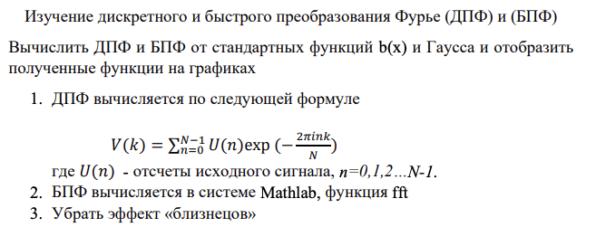
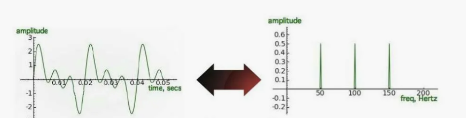
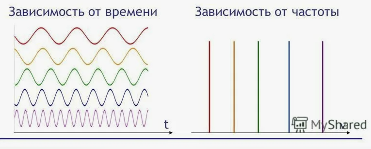
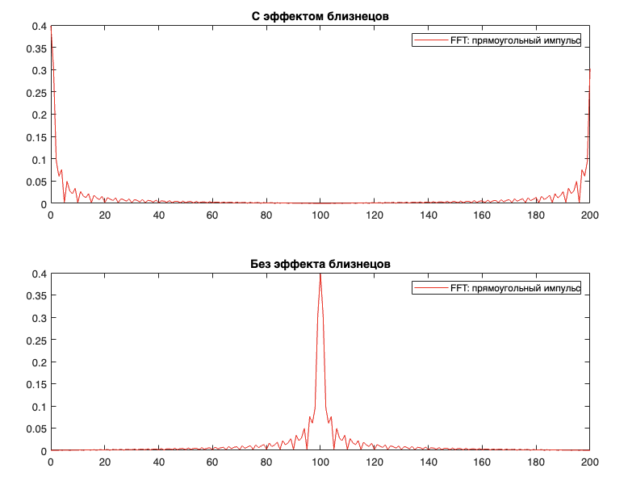
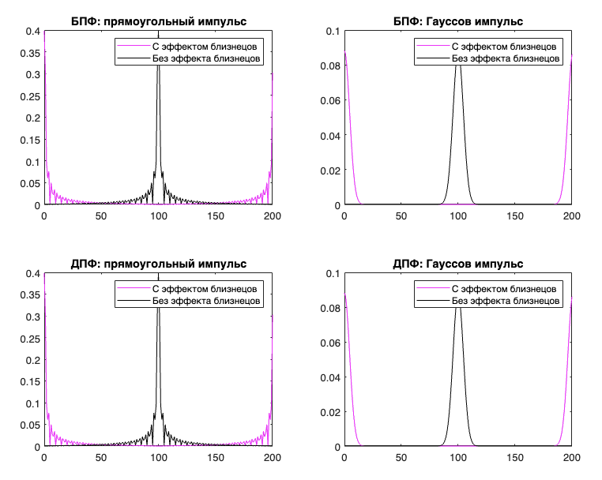

## ЛР 2

### Задание



Источник: https://github.com/Winterpuma/bmstu_DSP/tree/main/lab_02

---

### Дискретное преобразование Фурье (ДПФ)

ДПФ **преобразует последовательность комплексных или действительных чисел из временного представления в частотное**. То есть это переход от графика (время; амплитуда) к графику (частота; амплитуда).





Суть преобразования заключается в том, что любой сигнал можно представить как сумму синусоид и косинусоид с разными амплитудами и фазами. ДПФ вычисляет амплитуды и фазы этих синусоид и косинусоид, что позволяет анализировать частотный состав сигнала.

**Пример простым языком**:

Как выглядит преобразование Фурье на примере музыкальной ноты:

1. Исходная нота:
   - Представь, что играешь на фортепиано ноту "Ля" среднего октава.
   - Ты слышишь звук этой ноты, и ее амплитуда (громкость) меняется со временем.

2. Преобразование Фурье:
   - Теперь, давай произведем преобразование Фурье звука ноты "Ля".
   - Преобразование Фурье позволяет разложить этот звук на базовые частоты, из которых он состоит.
   - Ты увидишь, что звук "Ля" на самом деле состоит из главной (основной) частоты, которая определяет ноту, а также дополнительных гармонических частот, придающих звуку своеобразный тембр.

3. Частоты:
   - Преобразование Фурье поможет определить, сколько частот входит в звук ноты "Ля", и как сильно каждая из них присутствует в звуке.
   - Ты узнаешь, какие частоты генерируют основной звук ноты и какие добавляют "окраску" звука, делая его уникальным.

Таким образом, преобразование Фурье позволяет "разложить" сложные звуки на их составляющие частоты, помогая понять, какую "мелодию" вносят в общий звук различные составляющие частоты.

Амплитуда на графике (частота, амплитуда) показывает интенсивность соответствующей частоты (то есть в примере с нотой основная частота имела бы высокую амплитуду на графике, а все вспомогательные - низкую).

**Основные моменты по поводу ДПФ**:

1. дискретизация: ДПФ применяется к дискретному сигналу, то есть сигналу, который представлен в виде дискретных отсчетов во времени.

2. преобразование: ДПФ переводит сигнал из временной области в частотную область. Это позволяет выделить компоненты сигнала различных частот.

3. комплексные числа: результатом ДПФ является набор комплексных чисел, представляющих частоты и их амплитуды в сигнале.

4. частотный спектр: результатом ДПФ является частотный спектр, который показывает, какие частоты присутствуют в исходном сигнале и какова их амплитуда.

5. применение: ДПФ широко используется в обработке сигналов, акустике, обработке изображений, радиосвязи и других областях, где важно анализировать частотные характеристики сигналов.

---

### Быстрое преобразование Фурье (БПФ) 

БПФ - это **алгоритмы, которые эффективно вычисляют ДПФ**, значительно сокращая количество необходимых вычислений. Самым известным алгоритмом БПФ является алгоритм Кули-Тьюки, который предполагает, что количество точек сигнала является степенью двойки. БПФ значительно ускоряет обработку сигналов, делая возможным выполнение сложных анализов в реальном времени.

---

### Эффект близнецов

Эффект близнецов (также известный как эффект зеркального отображения или aliasing) **возникает при дискретизации сигналов, когда частоты выше половины частоты дискретизации (частота Найквиста) неправильно интерпретируются как более низкие частоты**. Это происходит из-за недостаточной частоты дискретизации, которая не соответствует теореме Котельникова. 

В результате, высокочастотные составляющие "отображаются" на низкие частоты, порождая искажения в сигнале. Искажения, вызванные эффектом близнецов, могут существенно ухудшить качество сигнала, приводя к потере важной информации и появлению ложных частотных компонентов. В аудио это может проявляться в виде нежелательных звуков или шумов. В изображениях - в виде муара и других артефактов. Чтобы избежать этих проблем, применяют антиалиасинговые фильтры перед дискретизацией сигнала, которые подавляют высокочастотные составляющие, не позволяя им вызывать искажения.

**Как возникает простым языком**:
1. Радиоволны, которые используются в радиосвязи, могут быть представлены в виде колебаний с определенной частотой.
2.  Повторяющиеся колебания радиоволн создают **цикличность** в сигнале, где сигнал "повторяется" через определенные временные или пространственные интервалы.
3.  Когда радиоволны отражаются от различных объектов и доходят до приемника через разные пути, возможно появление задержек во времени в приеме сигнала.
4.  Если задержанный сигнал кроется в том же диапазоне частот, что и оригинальный сигнал, то приемник может интерпретировать его как "дубликат" оригинального сигнала или "близнеца".
5.  Эффект близнецов, вызванный наложением частот, может создать интерференцию между оригинальным и отраженным сигналами.

> Интерференция — это явление волновой оптики или теории сигналов, когда два или несколько волн пересекаются в пространстве и времени, их амплитуды складываются в каждой точке их взаимодействия. Результатом этого взаимодействия может быть усиление или ослабление амплитуды волны в зависимости от фазовых соотношений между волнами.




---

### Код

```matlab
function lab_02()

% Объявили константы для квадратного сигнала и Гаусовского
T = 2.0;
A = 1.0;
sigma = 0.5;

% Границы расчета
mult = 5;
t = -mult:0.05:mult;

% Расчет импульсных функций. По аналогии с той лабой
x1 = zeros(size(t));
x1(abs(t) - T < 0) = 1;
x1(abs(t) == T) = 0.5;
x2 = A * exp(-(t/sigma).^2);

% БПФ
yx1 = fft(x1);
yx2 = fft(x2);

% Избавилась от близнецов
yg1 = fftshift(yx1);  % функция fftshift используется для сдвига результатов преобразования Фурье после применения функции fft
yg2 = fftshift(yx2);

% ДПФ. Посчитали с помощью нашей функции (ниже)
zx1 = dft(x1);
zx2 = dft(x2);
zg1 = fftshift(zx1);
zg2 = fftshift(zx2);
M = 0:length(t)-1;

...

% Функция для дискретного преобразования Фурье (см задание)
function y = dft(x)
a = 0:length(x)-1;
b = -2 * pi * sqrt(-1) * a / length(x);
for i = 1:length(a)
    a(i) = 0;
    for j = 1:length(x)
        a(i) = a(i) + x(j) * exp(b(i) * j);
    end
end
y = a;
end
```

---

### Результат работы программы



---

### Вопросы

- Что быстрее? БПФ
- Что точнее? Одинаковы
- Откуда эффект близнецов? Из цикличности, так как происходит наложение частот
- Цикличность чего? Спектра функции