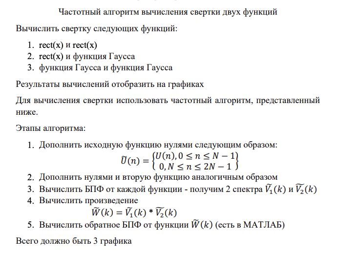
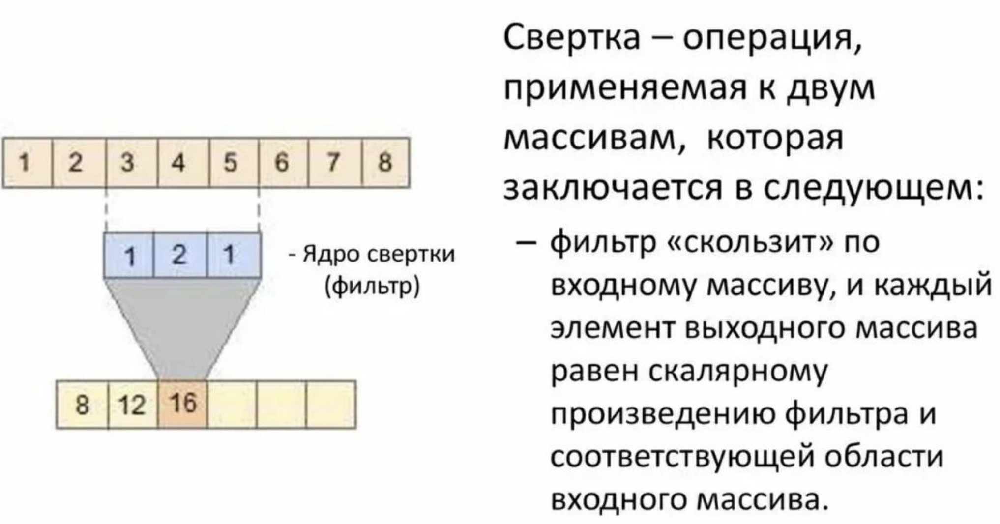
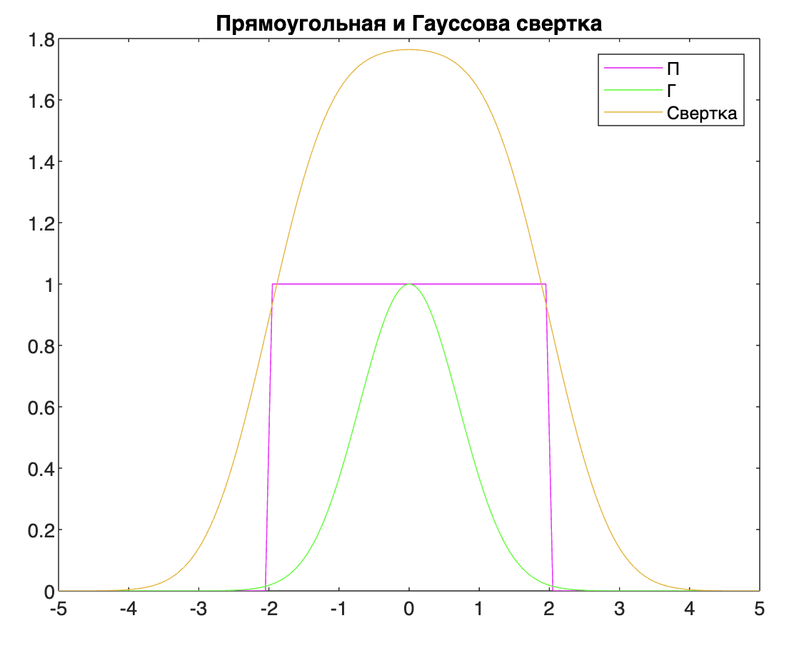
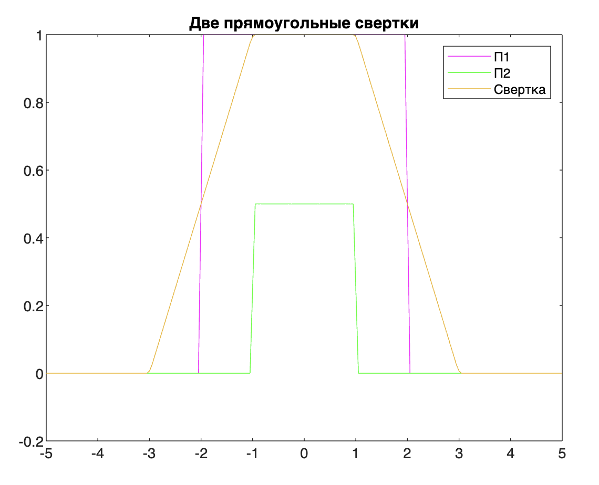
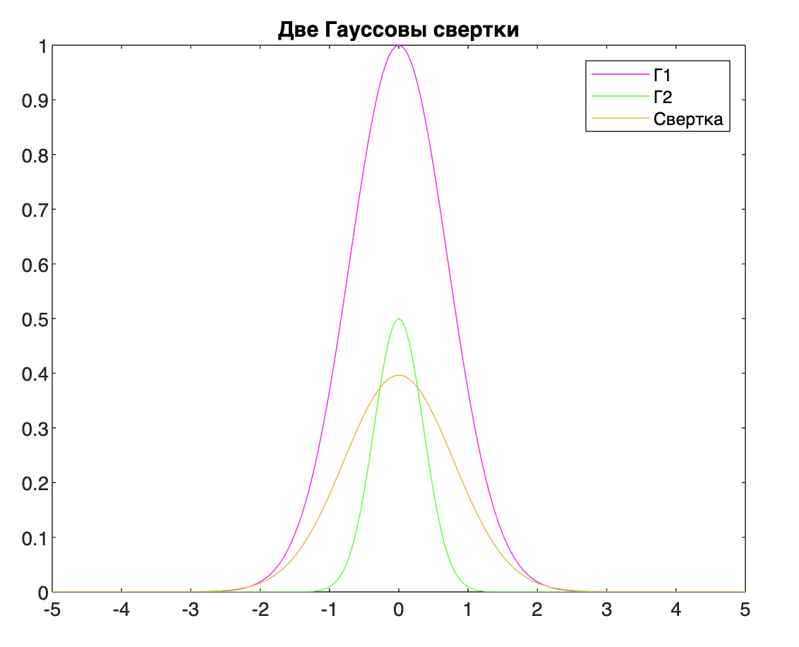

## ЛР 3

### Задание



Источник: https://github.com/Winterpuma/bmstu_DSP/tree/main/lab_03

---

### Свертка



### Свертка двух сигналов

Свертка сигналов — это как если бы ты перекрывал один сигнал другим и "просеивал" их через друг друга, чтобы увидеть, как они взаимодействуют на каждом моменте времени.

**Алгоритм**:

* есть два сигнала: сигнал №1 и сигнал №2
* "переворачиваем" сигнал №2
* смещаем его во времени и "перекрываем" его с сигналом №1
* для каждой точки времени перемножаешь значения сигналов и складываешь эти произведения

Cвертка позволяет определить, как два сигнала взаимодействуют между собой во времени. На выходе свертки получается новый сигнал, который отражает результат этого взаимодействия.

**Зачем нужна свертка**? - позволяет определить пространственную схожесть сигналов.

### Частотный алгоритм вычисления свертки двух функций

Частотный алгоритм свертки - это свертка частот. То есть раньше мы двигали сигналы по временной оси, а теперь будем двигать их частотные представления.

**Основные шаги частотного алгоритма свертки**:

1. преобразование Фурье для обоих сигналов.
2. умножение в частотной области: после преобразования каждой из функций в частотную область, производится поэлементное умножение результатов преобразований.
3. обратное преобразование Фурье: полученное произведение преобразований умножается на обратное преобразование Фурье, чтобы вернуться к сигналу во временной области.

**Простым языком разница между сверткой и частотной сверткой**:

> **Простая (временная) свертка:**
>
> * Ты берешь ингредиенты (сигналы) и смешиваешь их вместе в блендере (во времени).
> * В конце получаешь готовый коктейль (сигнал), который отражает результат смешивания в каждый момент времени. Ты видишь, как меняется вкус от первого глотка до последнего.
>
> **Частотная свертка:**
>
> * Теперь вместо блендера (временной области) ты используешь магическую формулу (преобразование Фурье), которая позволяет увидеть состав ингредиентов (частоты) в коктейле.
> * Ты смотришь на коктейль с точки зрения его спектра — какие ингредиенты (частоты) в нем присутствуют и в каких пропорциях. Например, сколько сахара, фруктов или спирта в нем.
> * Таким образом, частотная свертка позволяет увидеть структуру сигнала в его частотном представлении. Ты можешь понять, какие "вкусы" (частоты) присутствуют в сигнале и в какой мере они влияют на общий "вкус" (сигнал).

---

### Пример результатов







---

### Код

```matlab
function lab_03()

% Параметры импульсов
T = 2.0;            % для прямоугольного импульса шаг от 0 влево и вправо
A = 1.0;            % амплитуда
sigma = 1.0;        % параметр гауссовкого распеределения

% Границы расчета
mult = 5;               % левая и правая граница графика
step = 0.05;            % шаг расчета
t = -mult:step:mult;    % вектор оси x

% прямоугольный импульс
function y = rectpls(x,T,A)
    y = zeros(size(x));
    y(abs(x) - T < 0) = A;  % на интервале (-T, T) значение импульса A
    y(abs(x) == T) = A/2;   % в точках T и -T значение импульса A / 2
end

% Гауссов импульс
function y = gauspls(x,A,s)
	y = A * exp(-(x/s).^2); % формула из первой лр
end

% Генерация импульсов
x1 = [rectpls(t,T,A) zeros(1,length(t))];           % zeros(1,length(t)) -- дополнить массив 0 до размера t (см условие, пункт 1)
x2 = [gauspls(t,A,sigma) zeros(1,length(t))];
x3 = [rectpls(t,T/2,A/2) zeros(1,length(t))];
x4 = [gauspls(t,A/2,sigma/2) zeros(1,length(t))];

% Свертка
% Фурье-образ свертки равен произведению фурье-образов функций
% ifft - обратное преобразование Фурье
% fft - быстрое преобразование Фурье
% step помогает сохранить энергию и обеспечить правильный масштаб результатов свертки
y1 = ifft(fft(x1).*fft(x2))*step;       % прямоугольное * гауссовское
y2 = ifft(fft(x1).*fft(x3))*step;       % прямоугольное * прямоугольное
y3 = ifft(fft(x2).*fft(x4))*step;       % гауссовское * гауссовское

% Нормализовать свертку
% (обрезать свертку y1, чтобы она соответствовала по размеру массиву
% времени t)
start = fix((length(y1)-length(t))/2);
y1 = y1(start+1:start+length(t));
y2 = y2(start+1:start+length(t));
y3 = y3(start+1:start+length(t));
```


#### Про слово нормализация

Вообще я загуглила, зачем она может использоваться в данном случае:

1. **Сравнение различных сверток:** Нормализация позволяет сравнивать свертки разных сигналов, убирая различия в амплитудах. Без нормализации сигналы с большими амплитудами могут искажать результаты сравнения.

2. **Избегание переполнения:** После свертки амплитуда сигнала может стать очень большой, что может привести к переполнению при последующей обработке данных. Нормализация помогает избежать переполнения и сохранить адекватные значения амплитуд.

3. **Улучшение читаемости результатов:** Нормализованные свертки проще интерпретировать, так как амплитуда сигнала становится более понятной и соответствует физическому значению сигнала.

4. **Устранение фазовых и вариаций частот:** Нормализация также помогает убрать фазовые и вариации частот, которые могут возникнуть в результате свертки сигналов с различными амплитудами.

**НО**. как мне кажется, никакой нормализации в данном случае не происходит - мы просто обрезаем получившиеся результаты до интервала [-t/2, t/2]. Чтобы красиво вывести графики. Поэтому я фиг знает, насколько это норм слово.

---

### Вопросы

* Зачем используем частотную? 

  > Если хотим применить несколько фильтров, то в обычном мы бы считали сумму для каждого, а частотном мы бы их просто перемножили. Выигрыш во времени.
  >
  > (Фильтры обычно даются в частотном виде, поэтому свертка получается простым перемножением)

* Чем интересна свертка? -- позволяет выявить пространственную схожесть сигналов