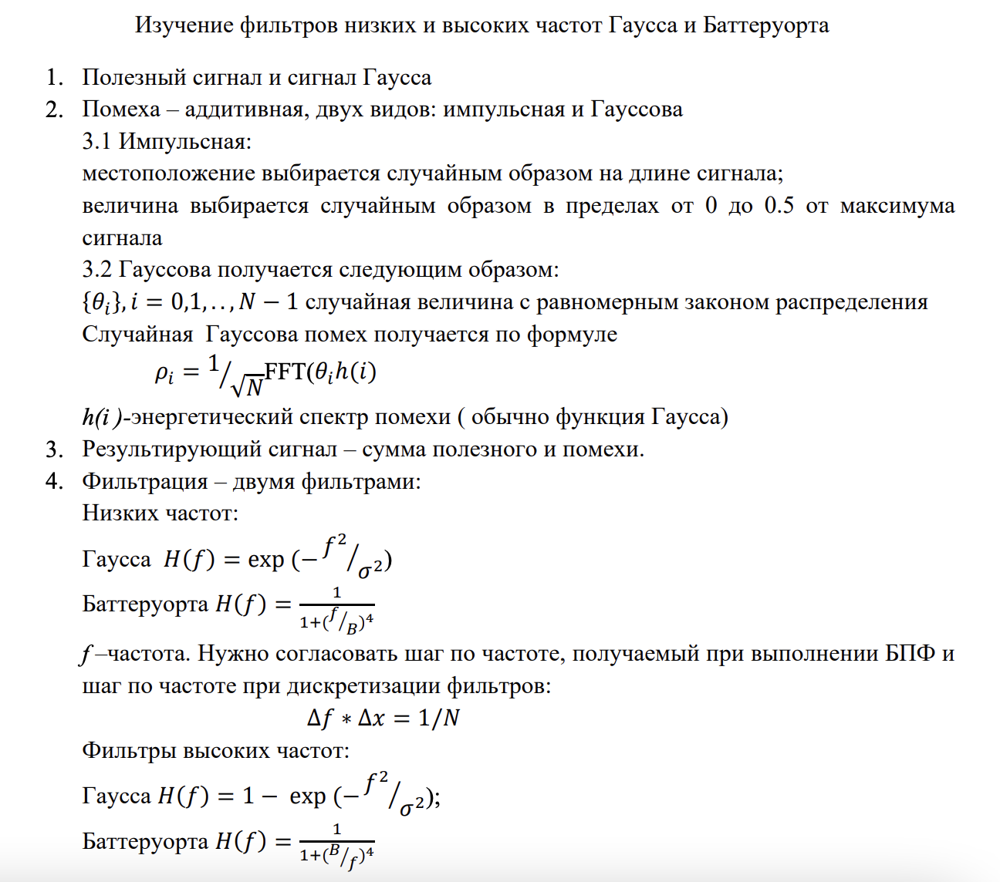
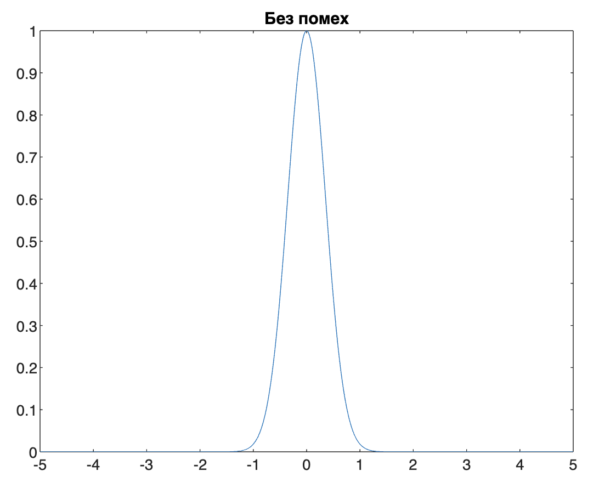
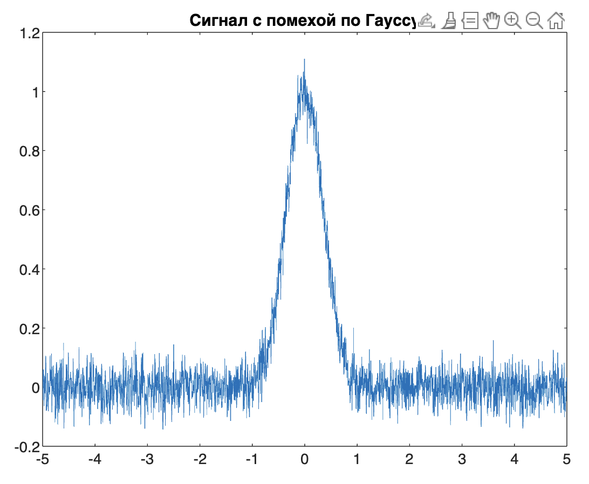
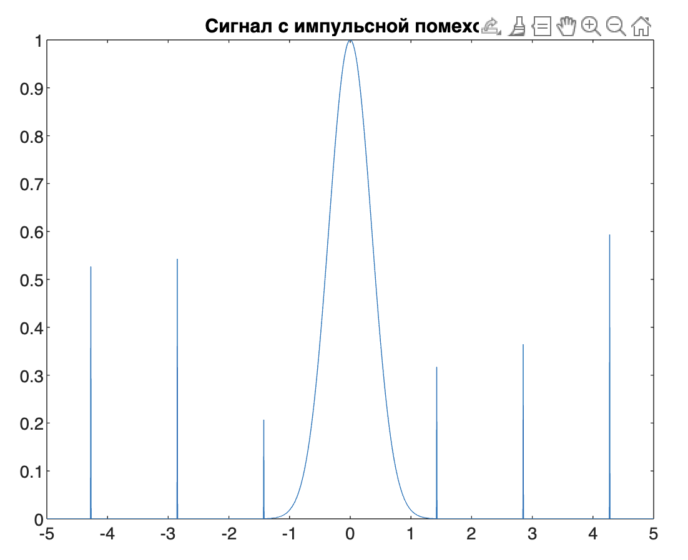
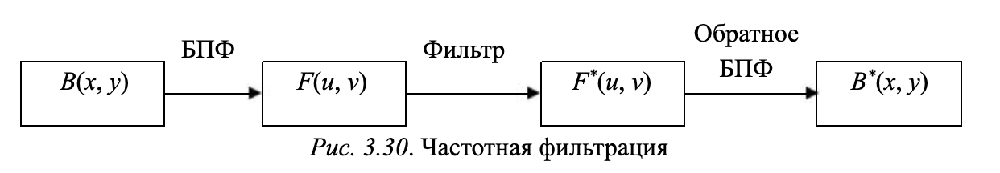
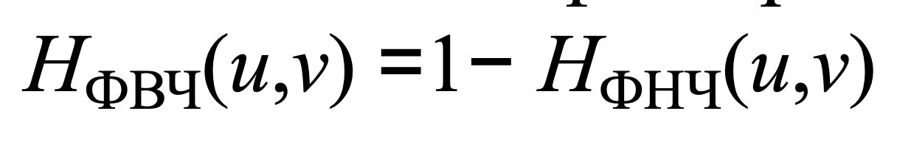
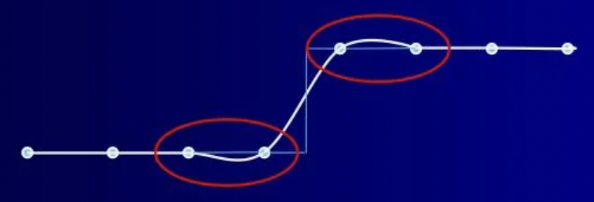

## ЛР 4

### Задание

Источник: https://github.com/Winterpuma/bmstu_DSP/tree/main/lab_04

---

### Теория

В лр работе используется сигнал Гаусса как основа. Вот его график:

**Помеха** -- шум, которые может возникать в сигналах или системах передачи информации. В лр используется два вида шума -- помеха Гаусса и импульсная помеха:

* **гауссовская помеха** -- помеха, которая следует нормальному распределению Гаусса и характеризуется случайными колебаниями сигнала вокруг его среднего значения.

  

* **импульсная помеха** -- кратковременные возмущения или аномалии в сигнале, выраженные в виде импульсов с высокой амплитудой

  

Для того, чтобы получения **результирующего сигнала** значения сигнала Гаусса и помехи складываются в каждой точке.

После получения результирующего сигнала перед нами встает задача обратно избавиться от помех. Делать мы это будем с помощью фильтров. В лр конкретно применение фильтра к сигналу не реализовано руками (делается через встроенную функцию filtfilt), но если бы мы хотели реализовать такое сами, то нужно было бы переводить сигнал в частотную форму и перемножить его с частотной формой фильтра.

**Фильтры Гаусса и Баттеруорта** - это разновидности фильтров, используемых в обработке сигналов и изображений для сглаживания, уменьшения шума или выделения определенных частот.

Можно фильтровать низкие частоты (4 лр), можно высокие (5 лр), для этого используются разные функции, см задание.

> Детали и острые края на изображении отражают значительные изменения яркости на коротких расстояниях и связаны с высокими пространственными частотами. Плавные изменения яркости связаны с низкими пространственными частотами.

**Низкочастотные фильтры**  уменьшают или удаляют высокие частоты, присутствующие в плоскости БПФ. Они подавляют информацию, связанную с быстрыми изменениями яркости на изображении в пространственной области. В таком случае в результате обратного БПФ возникает *изображение, на котором шум, детали, острые края сглажены*.

**Высокочастотные фильтры** уменьшают или удаляют низкие частоты, присутствующие в БПФ-плоскости. В результате их действия подавляются медленные изменения яркости на изображении в пространственной области. В этом случае в результате обратного БПФ *получается изображение, на котором яркость всех объектов уменьшена, а детали усилены*.

**Низкие частоты**:

* фильтром Гаусса

  

* фильтром Баттеруорта

  

**Высокие частоты**:

* фильтром Гаусса

  

* фильтром Баттеруорта

  

---

### Вопросы

1. Почему не используем идеальный фильтр? -- будет возникать эффект Гиббса

   > Идеальные фильтры обладают строгими частотными характеристиками: они полностью подавляют частоты, находящиеся выше (в случае нижних частот) или ниже (в случае верхних частот) определенного порогового значения. При этом происходит явление Гиббса, что приводит к появлению резких колебаний в области перехода между подавленными и неподавленными частотами. Явление Гиббса может быть наглядно видно в областях изображения, где встречаются резкие края или детали с высокочастотными компонентами. На изображении это проявляется как видимые артефакты — яркие и темные области возле контуров или краев, создавая нежелательные "волнушки" или "шашечки" вокруг резких переходов.

   > В отличие от идеального ФНЧ при использовании ФНЧ Баттерворта происходит плавное уменьшение степени размывания при увеличении частоты среза, при использовании низких порядков фильтра звон на обработанном изображении не заметен (т. к. фильтру свойственен гладкий переход между низкими и высокими частотами).
   >
   > Как и в случае ФНЧ Баттерворта, при увеличении частоты среза ФНЧ Гаусса возникает плавное уменьшение степени размывания. Обратное БПФ от ФНЧ Гаусса также есть гауссова функция, поэтому пространственный гауссов фильтр, полученный вычислением обратного БПФ, не создает звона.

2. Что произойдет с краями, если применить фильтр низких частот к изображению? -- станут размытыми (поможет ответить свертка прямоугольного импульса).

3. Зачем нужен фильтр высоких частот? -- показать малоразличимые объекты на фото, но фотография при этом станет темнее.

4. Где находится результат фильтрации на графике? -- показать график

5. Что происходит с интенсивностью? -- становится значительно ниже.

   > чем ниже интенсивность, тем темнее изображение

6. Что будет если применить фильтр высоких частот к изображению? -- фотография станет темнее

7. После применения фильтра высоких частот малоразличимые фото становится тёмным. А как его сделать обратно светлыми и чтобы мелкие детали видны были? -- надо добавить константу (среднюю интенсивность) к передаточной функции.

   > Передаточная функция какого-то фильтра - выражение H(f), см задание.

   > Простым языком - добавление константы к передаточной функции фильтра позволит увеличить яркость всего изображения, делая его визуально более светлым. При этом мелкие детали сохранятся, так как мы просто "поднимаем" уровень освещенности всего изображения.

   > Доп. передаточная функция высокочастотного фильтра может быть получена из заданного низкочастотного фильтра при помощи соотношения:
   >
   > 

Источник: https://github.com/prianechka/BMSTU-DSP, цитаты-комментарии мои

---

#### Дополнительно. Эффект Гибса

**Определение**: явление, которое проявляется при аппроксимации кусочно-постоянной функции с помощью ряда Фурье. Этот эффект проявляется в виде наблюдаемых осцилляций или "выбросов" в окрестности точек разрыва или краевых точек функции.

**Причина появления:** этот эффект обусловлен невозможностью ряда Фурье аппроксимировать точечные изменения в функции точно и сразу. Это приводит к "выбросам" в виде дополнительных колебаний в окрестности точек разрыва, что является типичным для явления Гибса.

