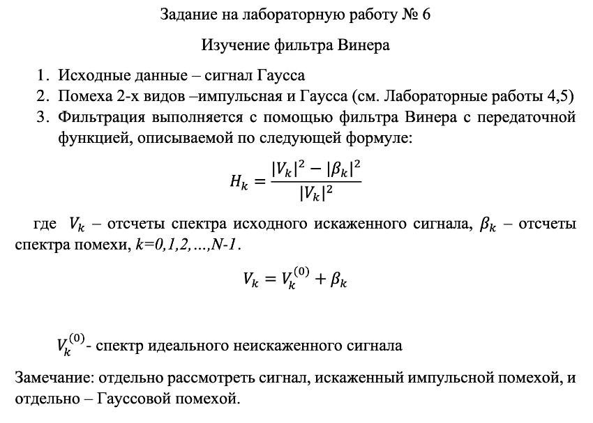

## ЛР 6

### Задание

Источник: https://github.com/prianechka/BMSTU-DSP/tree/main

---

### Что происходит

Вообще в плане общей логики все ровно также, как в 4-5 лабах. Был сигнал Гаусса, к нему добавили две разные помехи (банальным сложением) - Гаусса и импульса, потом используя фильтр Винера получили обратно красивый сигнал. 

### Фильтр Винера

Фильтр Винера — это инструмент для удаления шума из сигнала. В основе его работы — поиск оптимального отношения между полезным сигналом и помехами для улучшения качества сигнала.

Самая простая аналогия — это когда вы говорите по телефону в шумном месте, и ваше устройство пытается "вычленить" ваш голос из общего шума фона, чтобы другой человек на той стороне мог вас услышать.

Фильтр Винера "оценивает" шум и пытается его уменьшить, оставив при этом полезный сигнал максимально четким и ясным. Для этого он учитывает как характеристики полезного сигнала, так и характеристики шума.

**Его основная цель - минимизация ошибки между оригинальным сигналом и восстановленным после деформации из-за шума.**

### Вопросы

1. Почему фильтр Винера дает более качественный результат, чем фильтр низких частот? 

   >  Потому что в формуле для фильтра также учитываются помехи.

2. Функция импульсного отклика - во временной области, а как называется такая же в частотной? 

   > Передаточная функция.

3. Как называется функция искажения? Её смысл? 

   >  Функция импульсного отклика. Смысл -- реакция системы на импульс.

4. Какие требования накладываются на помеху (шум) при использовании этого метода?

   > Аддитивность и статистическая независимость.

5. Частный случай фильтра Винера?

   > Режекторный фильтр (не пропускает помехи в определенном диапазоне значений)

6. Пизже ли фильтр Винера чем ФНЧ?

   > Пизже, потому что он учитывает наличие шума в сигнале, что даёт ему бОльшую стабильность

