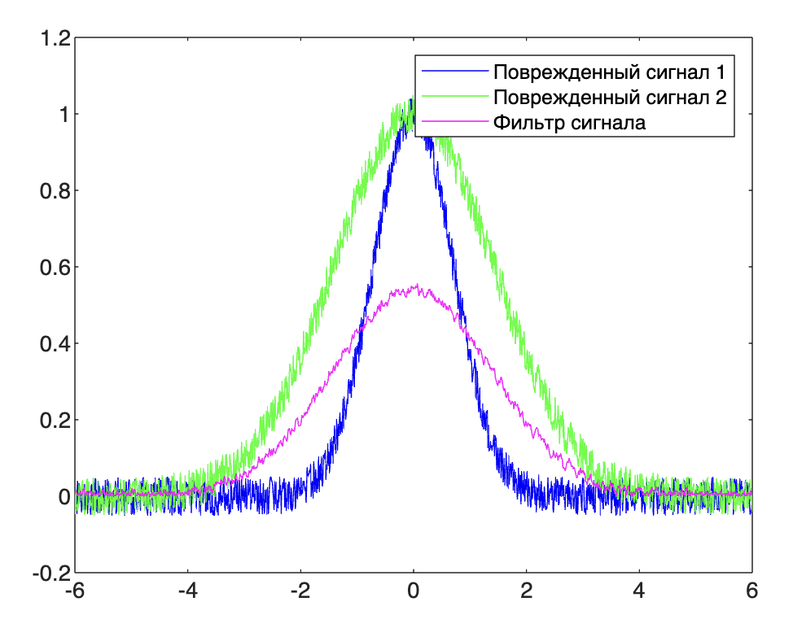

## ЛР 7

### Задание

Синтез линейных фильтров методов регуляризации Тихонова.

https://github.com/Winterpuma/bmstu_DSP/blob/main/lab_07/DSP_Task_7.pdf

---

### Теория

#### Регуляризация Тихонова 

Этот метод используется для решения некорректно поставленных задач, то есть задач, которые могут иметь несколько решений или решений вообще не существует. Например могут быть задачи, где небольшое изменение в входных данных может сильно изменить результат. Регуляризация Тихонова вводит дополнительное "штрафное" слагаемое в уравнение, чтобы сделать задачу более "стабильной", ограничивая сложность решения. 

#### Синтез фильтров 

Фильтры в цифровой обработке сигналов используются для того, чтобы изменить некоторые аспекты сигнала. Например, они могут убирать шумы или выделять определенные частоты. 

Синтез фильтров - это процесс разработки такого фильтра, который бы наилучшим образом удовлетворял определенным требованиям.

#### Синтез + регуляризация

Допустим, у вас есть очень "грязный" аудиосигнал и вы хотите его "очистить" с помощью фильтра. Вы стараетесь сделать аудиосигнал более ясным, не теряя при этом важные детали. Но эту задачу можно решить многими способами и не все решения будут "хорошими". Например, одно решение может привести к перефильтрованию, когда удаляются не только шумы, но и важные детали, а другое может не полностью убрать шумы. 

Метод регуляризации Тихонова помогает в этом случае, добавляя "штраф" за слишком "сложные" фильтры, и тем самым приводит к более "простому" и стабильному фильтру, который лучше подходит для задачи.

----

### Практика

> В результате этот код показывает, как можно использовать метод Тихонова для уменьшения влияния шума на сигнал.

```matlab
function lab_07()
    A = 1.0;
    s1 = 1.0;
    s2 = 2.0;
    mult = 6;
    step = 0.009;
    NS = 0.05;
    t = -mult:step:mult;

    % параметры для генерации двух гауссовых сигналов u1 и u2 с разными скоростями затухания (s1 и s2)
    u1 = A * exp(-(t/s1).^2);
    u2 = A * exp(-(t/s2).^2);

    % сигналы преобразуются в частотную область с помощью преобразования Фурье
    v1 = fft(u1);
    v2 = fft(u2);

    % белый шум для каждого из сигналов (это будет делать эти сигналы "поврежденными")
    n1 = unifrnd(-NS, NS, 1, length(t));
    n2 = unifrnd(-NS, NS, 1, length(t));

    % вычисляются стандартные отклонения шума
    delta = std(n1);
    epsilon = std(n2);

    figure(1);
    plot(t, u1+n1, "b", t, u2+n2,"g", t, abs(ifft(fft(u2+n2) .* tikhonfilt(v1, v2, step, 2 * mult, delta, epsilon))),"m");
    legend('Поврежденный сигнал 1','Поврежденный сигнал 2','Фильтр сигнала');
end

%  Фильтр Тихонова. Эта функция берет зашумленные входные сигналы, использует fzero() для нахождения оптимального значения параметра регуляризации alpha и затем применяет фильтр Тихонова, чтобы вычислить фильтрованные версии сигналов u1 и u2.
function h = tikhonfilt(u1, u2, step, T, d, e)
    m = 0:length(u1)-1;
    mult = step / length(u1);
    squ = 1 + (2 * pi * m / T).^2;
    func = @(x) rhofunc(x, u1, u2, step, T, d, e);
    alpha = fzero(func, [0, 1]);
    h = 0:length(u1)-1;
    for k = 1:length(h)
        h(k) = mult * sum(exp(2 * pi * 1i * k .* m / length(u1)) .* u1 .* conj(u2) ./ (abs(u2).^2 .* step^2 + alpha * squ), 2);
    end
end

% Вспомогательная функция, которая вычисляет разницу между beta (квадрат интеграла весового коэффициента регуляризации) и квадратом шума (сумма d и произведение e и квадратного корня gamma)
function y = rhofunc(x, u1, u2, step, T, d, e)
    m = 0:length(u1)-1;
    mult = step / length(u1);
    squ = 1 + (2 * pi * m / T).^2;
    beta = mult * sum(x.^2 * squ .* abs(u1).^2 ./ (abs(u2).^2 * step^2 + x .* squ).^2, 2);
    gamma = mult * sum(abs(u2).^2 * step^2 .* abs(u1).^2 .* squ ./ (abs(u2).^2 * step^2 + x * (1 + 2 * pi * m / T).^2).^2, 2);
    y = beta - (d + e * sqrt(gamma))^2;
end
```



---

### Вопросы

1. Что на картинке?

   > Сигнал не искажённый, сигнал искажённый, функция импульсного отклика

2. Нахуя функция импульсного отклика?

   > Это реакция системы на входной сигнал (по сути то, что нам косоебит сигнал)

   > *Функция импульсного отклика является важным инструментом в области систем управления и сигнальной обработки. Её основное назначение - описать поведение линейной системы в ответ на входной импульсный сигнал (или дельта-функцию). Зная функцию импульсного отклика, можно предсказать, как система будет реагировать на любой другой входной сигнал путем свертки его с этой функцией. Это позволяет анализировать и проектировать системы, определять их стабильность, частотные характеристики и другие параметры.* - выхлоп чатгопоты

   Есть еще ответ *реакция системы на импульс*.

3. Почему именно метод Тихонова?

   > Он позволяет найти приближенное решение некорректно поставленной задачи (когда малые изменения входных данных могут перекосоебить решение в тотал)

4. В чем идея метода Тихонова?

   > Добавляем параметр регуляризации к исходной задаче (уравнение из лекций, у меня нема) с целью минимизации функционала

   > *Метод регуляризации Тихонова - это математический метод, который используется для решения проблемы неустойчивости или недоопределенности в задачах восстановления сигналов или обратных задачах. Идея этого метода заключается в том, чтобы добавить дополнительное условие (регуляризацию) к исходной задаче оптимизации, чтобы получить более устойчивое и надежное решение.

   > Суть метода заключается в минимизации функционала ошибки, который включает две составляющие: первая часть отражает качество приближения решения к измеренным данным, а вторая часть представляет собой регуляризационный член, который контролирует гладкость или другие свойства решения. Регуляризация Тихонова добавляет норму решения (обычно L2-норму) к функционалу ошибки, чтобы ограничить сложность решения и предотвратить переобучение.
   >
   > Использование метода регуляризации Тихонова позволяет балансировать между точностью приближения и устойчивостью решения, что делает его широко применимым в различных областях, таких как обработка сигналов, машинное обучение, обратные задачи в физике и многих других.* - выхлоп чатгопоты

5. Почему фильтр Тихонова лучше, чем фильтр Винера?

   > С помощью параметра альфа можно, изменяя его, подгонять и смотреть, лучше изображение, или хуже. При решении задачи в лоб мы получаем неустойчивые результаты, а вот с помощью параметра альфа в алгосе тихонова результаты становятся устойчивыми. При стремлении альфа к нулю функция стремится к точному нужному нам значению. Но при равенстве 0 результаты становятся неустойчивыми, поэтому типа надо как-то понять, какой альфа туда подставлять.

6. Какой физический смысл 3ей линии?

   > По неискаженному и искаженному сигналам вычислили третью линию, которая и исказила сигнал
7. Функция импульсного отлика чего?
   > функция импульсного отклика искажающей среды

   (контекс: фиолетовая линия была подписана, как ФИО, он сказал, что ФИО в вакууме не бывает, ответ ФИО фильтра Тихонова - неправильный)
