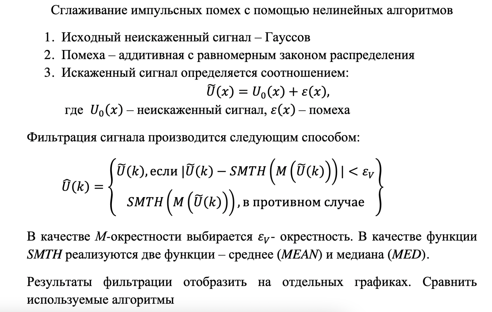
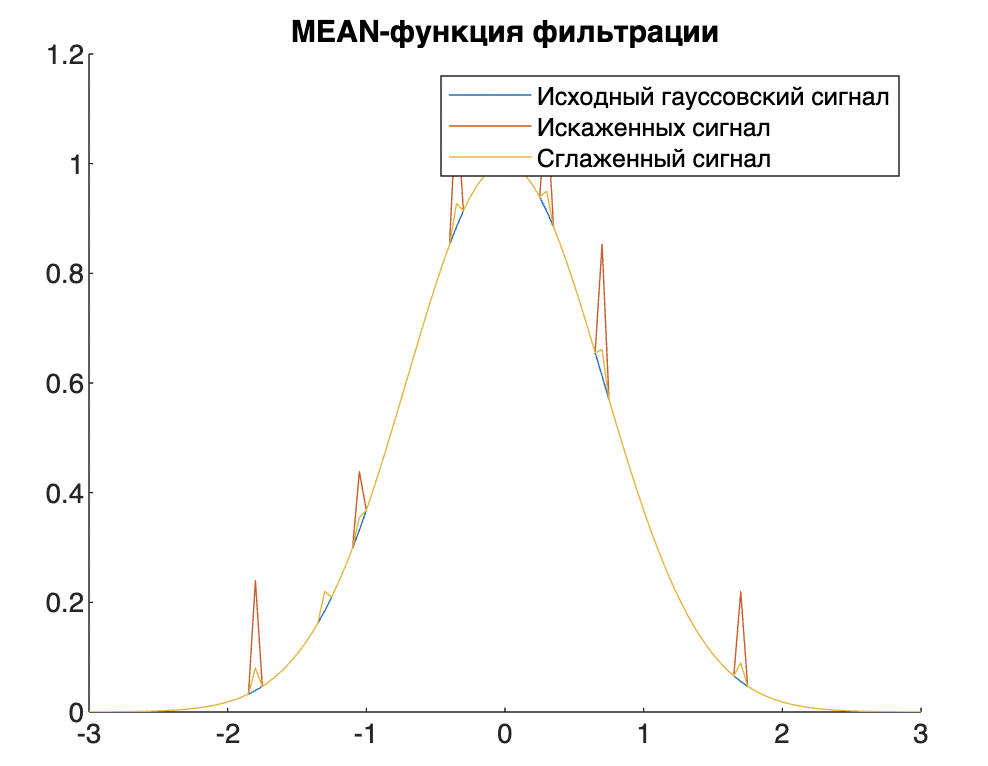
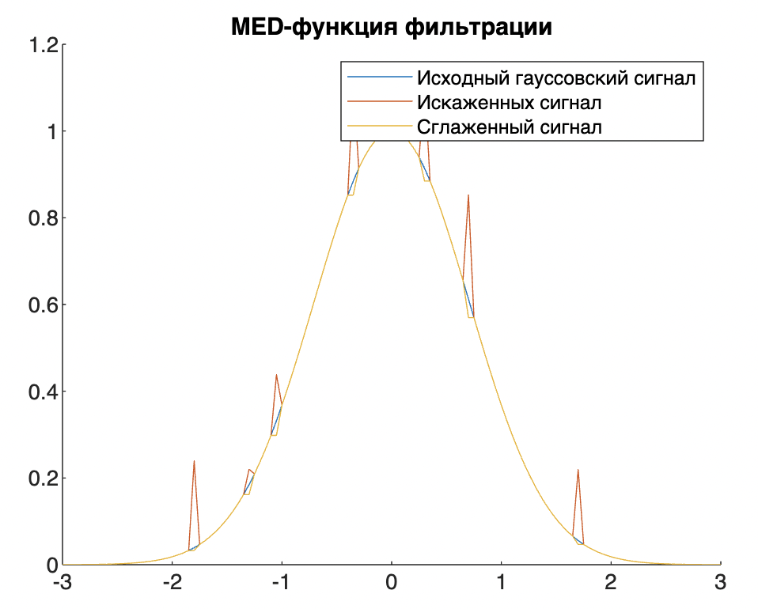

## ЛР 8

### Задание

Источник: https://github.com/Winterpuma/bmstu_DSP/tree/main/lab_08

---

### Теория

Теории не будец, в трех словах, что происходит: есть помехи в сигнале, мы хотим их сгладить. Для этого используем два способа:

1. MEAN - ищем среднее 5 точек (центральная точка, 2 точки слева, 2 точки справа), если среднее меньше, чем значение в центральной точке, значит меняем центральную точку на полученное среднее
2. MED - аналогично, только ищем наименьшее из точки слева и точки справа от центральной (заменяем, если значение меньше значения в центральной точке)

Усе

---

### Практика

---

### Вопросы

* Что лучше? 

  > медианный, потому что видно что сглаживает лучше

* 2 типа ошибок фильтраций помех

  > 1. ошибка пропуска помехи (когда фильтр считает что это(помеха) полезный сигнал и не сглаживает) (возникает, если эпсилон слишком большое)
  > 2. ложная тревога, когда фильтр подумал что всплеск это помеха (эпсилон слишком маленькое)

  > P.S. Ложная тревога -- это название ошибки (когда часть сигнала вопспринимается за помеху)
  >
  > P.S.S. Чтобы избавится от ошибок мы берем (min + max) / 2 или поочередно сначало большое значение, потом маленькое ????

* Как сгладить максимально чтобы на концах не было размытия:

  > шок фильтр 
  >
  > би-латеральный фильтр

* Какие 2 вида задач решает сглаживание сигнала?

  > 1.  убрать малоразмерные помехи 
  >
  > 2. убрать малоразмерные детали сигнала

* Какие методы использовали?

  > метод средних и медианный